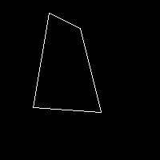

# Convex Polygon Generator in Python

Given script can be used to generate convex polygons with a specified number of sides.

Below are some demonstration on how the algorithm works.

### Demonstration

 
 

**4 sided convex polygon** &nbsp;&nbsp;&nbsp;&nbsp;&nbsp;&nbsp;**5 sided convex polygon** 

### Results 
 
 
 

&nbsp;&nbsp;&nbsp;&nbsp;&nbsp;&nbsp;**4 sided convex polygons**

 
 
 

&nbsp;&nbsp;&nbsp;&nbsp;&nbsp;&nbsp;**5 sided convex polygons**

### Usage

`python3 generate.py `

**Optional Parameters**
` --save` : _Writes the final image on disk._
`--visualize` : _Shows the process of the algorithm through a series of images._
`num_of_sides` : _Define the number of points that should be generated. Minimum value is `3`._
`img_height` : _Define the height of the image._
`img_width` : _Define the width of the image._
`padding` : _Define the padding value. Padding is used to control the how close the generated points should be to the borders of the image._
`max_iter` : _Define the maximum number of iterations before the algorithm restarts._
`min_angle` : _Define the minimum angle between two adjacent sides._
`min_side_length` : _Define the minimum length for each side._

License
----

MIT
